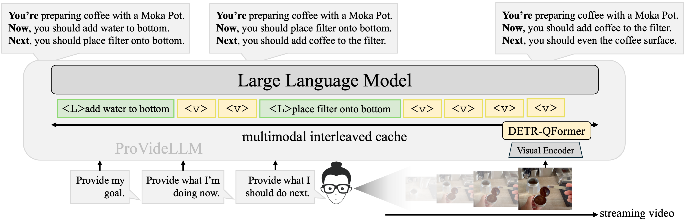

# ProVideLLM: Streaming VideoLLMs for Real-time Procedural Video Understanding

This repository provides official implementation of:
> **Streaming VideoLLMs for Real-time Procedural Video Understanding (ICCV 2025)**  
>Dibyadip Chatterjee, Edoardo Remelli, Yale Song, Bugra Tekin, Abhay Mittal, Bharat Bhatnagar, Necati Cihan Camgöz, Shreyas Hampali, Eric Sauser, Shugao Ma, Angela Yao, and Fadime Sener.  

[](https://dibschat.github.io/ProVideLLM)
[](https://arxiv.org/abs/2504.13915)

> [!NOTE]
> **Release (Oct 2025):**  
> This release upgrades the visual encoder to [SigLIP 2](https://arxiv.org/abs/2502.14786) which provides strong language alignment while **preserving patch-level objectness through dense supervision.
> We also pretrain DETR-QFormer on the larger EgoClip split (thanks to [Helping-Hands](https://github.com/Chuhanxx/helping_hand_for_egocentric_videos)) instead of EPIC-KITCHENS, further improving accuracy and advancing SOTA on EgoExo4D and COIN.

## To-Do
- [ ] Release verbalize & interleave code for streaming per-frame inference
- [ ] Release online step detection training and evaluation for Ego4D-Goalstep
- [ ] Release DETR-QFormer Stage-1 pretrained checkpoint
- [x] Released training and evaluation for EgoExo4D and COIN
- [x] Released DETR-QFormer Stage-1 pretraining code on EgoClip

## Overview

ProVideLLM is a **streaming VideoLLM** for **real-time procedural video understanding**.
It interleaves *verbalized long-term text tokens* and *DETR-QFormer encoded short-term visual tokens* within a multimodal cache, enabling:

- **sub-linear memory and compute scaling** with video length  
- **22× fewer tokens** compared to existing streaming/online VideoLLMs for representing an hour long video
- 🏆 **state-of-the-art** on EgoExo4D Keystep Recognition (#1 in [Leaderboard](https://eval.ai/web/challenges/challenge-page/2273/leaderboard/5627))
- 🏆 **state-of-the-art** on COIN dataset across 5 tasks




## Model Variants

- **ProVideLLM-1B/5** — A **lightweight streaming model** optimized for real-time tasks.
  Achieves **>10 FPS** per-frame inference and **>25 FPS** streaming narration, running on a **single GPU with ~2 GB memory**.

- **ProVideLLM-8B/11** — A **high-performing model** designed for **fine-grained offline video understanding**.  
  Delivers **state-of-the-art accuracy** on procedural video benchmarks.


---

### Requirements
The following setup has been tested on Python 3.12 with CUDA 12.4.
```bash
conda create -n providellm python=3.12
conda activate providellm

pip install numpy pandas tqdm matplotlib scipy prettytable datetime

pip install torch==2.5.1 torchvision==0.20.1 torchaudio==2.5.1 xformers --index-url https://download.pytorch.org/whl/cu124
pip install transformers==4.48.0 deepspeed==0.14.4 ninja accelerate peft editdistance Levenshtein wandb moviepy submitit timm opencv-python
pip install flash-attn --no-build-isolation
```
We use torchcodec for consistent video decoding across datasets:
```bash
conda install ffmpeg==7.1.1 -c conda-forge
pip install torchcodec==0.1 --index-url=https://download.pytorch.org/whl/cu124
```

## Citation

If you find our work useful, please cite:

```bibtex
@article{chatterjee2025memory,
  title={Memory-efficient Streaming VideoLLMs for Real-time Procedural Video Understanding},
  author={Chatterjee, Dibyadip and Remelli, Edoardo and Song, Yale and Tekin, Bugra and Mittal, Abhay and Bhatnagar, Bharat and Camg{\~A}{\c{k}}z, Necati Cihan and Hampali, Shreyas and Sauser, Eric and Ma, Shugao and others},
  journal={arXiv preprint arXiv:2504.13915},
  year={2025}
}
```

## Acknowledgements
This work builds upon the excellent open-source efforts of [VideoLLM-Online](https://github.com/showlab/videollm-online).
We also thank [Helping-Hands](https://github.com/Chuhanxx/helping_hand_for_egocentric_videos) for providing pre-extracted hand–object bounding boxes for EgoClip.